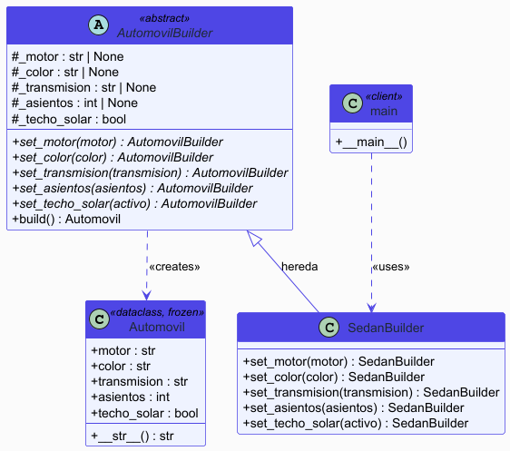
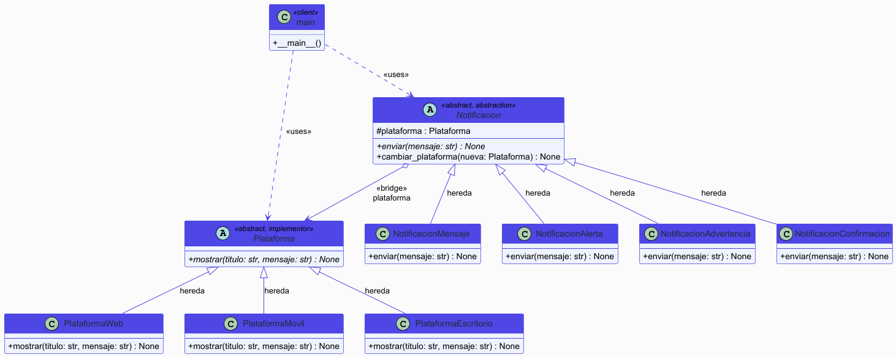
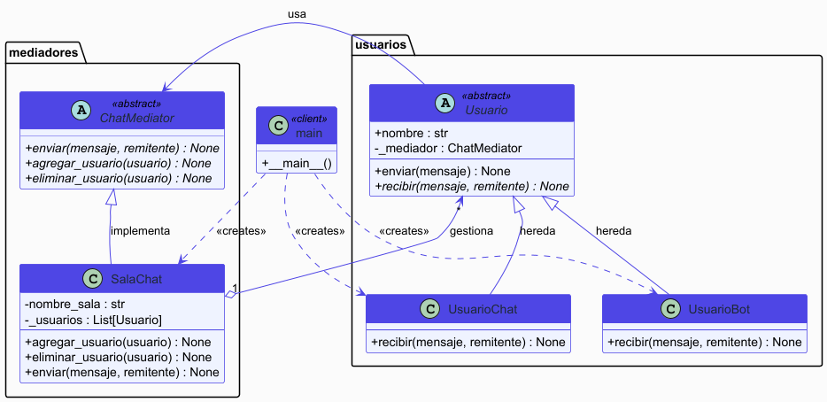

# Actividad - Patrones de Diseño

Tres ejercicios prácticos implementando patrones de diseño en Python.

--- 
### Realizado por
**Fabian Andres Rojas Garcia**
**Codigo: 0000393714**

## Escenario 1 - Builder: Construcción de un Auto

El ejercicio simula armar un auto paso a paso. En vez de pasarle 10 parámetros a un constructor, usás un builder que te deja ir configurando cada parte del auto (motor, color, transmisión, asientos, etc.) y al final llamás `.build()` para obtener el objeto listo.

Se implementó un `SedanBuilder` que construye un auto de tipo sedán con sus opciones particulares.

**Patrón:** Builder

---

## Escenario 2 - Bridge: Sistema de Notificaciones

El ejercicio modela un sistema donde hay distintos **tipos de notificación** (mensaje, alerta, advertencia, confirmación) y distintas **plataformas** donde se muestran (web, móvil, escritorio).

El problema clásico es que si metés todo junto terminás con una clase por cada combinación (AlertaWeb, AlertaMovil, MensajeEscritorio...). Con Bridge separás las dos cosas: el tipo de notificación no sabe nada de la plataforma, y la plataforma no sabe nada del tipo. Los conectás en el momento que querés.

También se puede cambiar la plataforma en caliente sin tocar la notificación.

**Patrón:** Bridge

---

## Escenario 3 - Mediator: Chat Grupal

El ejercicio simula un chat grupal donde los usuarios no se hablan directamente entre sí. En cambio, todos le mandan mensajes a la sala (el mediador), y la sala se encarga de distribuirlos a los demás.

Esto evita que cada usuario tenga que conocer a todos los otros usuarios. También hay un bot en la sala que responde automáticamente si alguien saluda.

**Patrón:** Mediator

